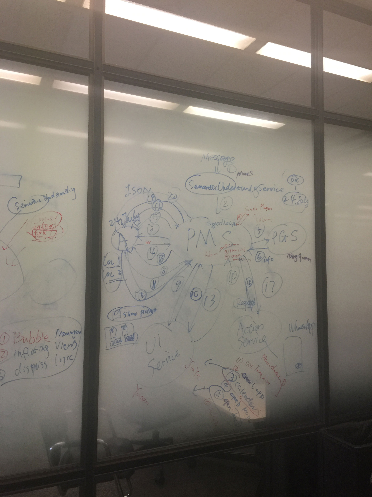
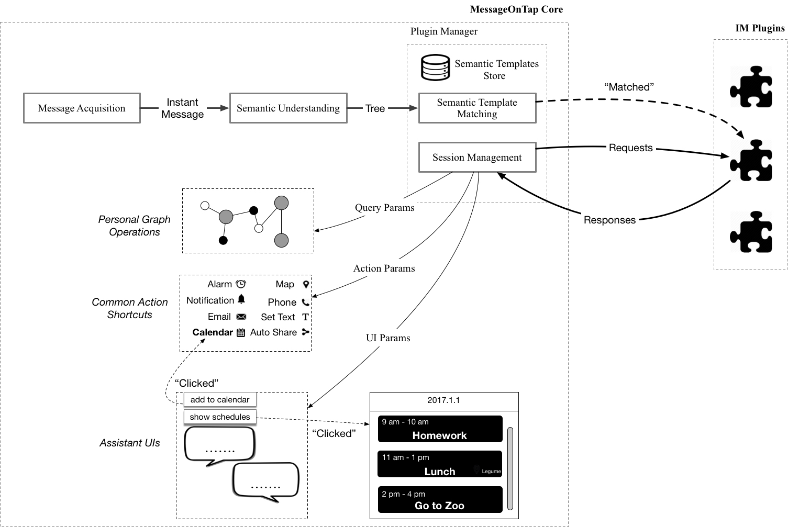

**This repo is not completed yet.**

# MessageOnTap_API
IPC (Interprocess Communication) library powering plugins for MessageOnTap, a development framework for personal-data-powered messaging assistants.

**Change Log**

The newest version of MessageOnTap API is <u>0.3.4</u>, release date of which is <u>August 15, 2017</u>.

[Click here](CHANGELOG.md) to see full change log history.

## About MessageOnTap
[MessageOnTap](https://github.com/chentc/MessageOnTap) is a development framework for personal-data-powered messaging assistants.

## Official Plug-Ins
Official plug-ins of MessageOnTap can be found here: [MessageOnTap_Plugins](https://github.com/adamyi/MessageOnTap_Plugins).

## How to Develop a MessageOnTap Plug-In?
### How Plug-Ins Work?
<!---->

In MessageOnTap development framework, while plugins are in charge of the logical flow (what to do after users receive certain messages), MessageOnTap-Core does the heavy lifting to offer message acquisition, message understanding, common action shortcuts, and personal graph operations.

When a plugin is enabled by the user, MessageOnTap-Core will ask plugins to set up custom tags to classify words in users' instant messages and triggers to set what kind of messages this plugin deals with. When user receives a message, MessageOnTap-core will analyze it and store it as a ParseTree with tags matched, and will then match all the triggers set by plugins.

If one trigger is matched, MessageOnTap-Core will initiate a new session and send the ParseTree to the plugin, to which the trigger belongs. The default task is therefore created (Task ID = 0). When the plugin has done responding to that message, plugin has to send a response back to MessageOnTap-Core so that it can acknowledge the end of the default task, which also mean the end of the session. Besides the default task which is initiated by MessageOnTap-Core, plugins can initiate their own tasks as well (Task ID > 0) to inform MessageOnTap-Core to perform different things. When those requests are completed, a response packet will be sent back to the plugin from MessageOnTap-Core. Those tasks are classified to the following types:

* **UI**, showing bubbles or HTML modals;
* **Action**, performing all sorts of actions that need to call other applications, like sending an email;
* **Graph**, queries and updates of the Personal Graph;
* **PMS**, related to session management. These are automatically created by API. Developers can ignore this.

### Web Development Portal
*TBA...*
### Development Document
*TBA...*
