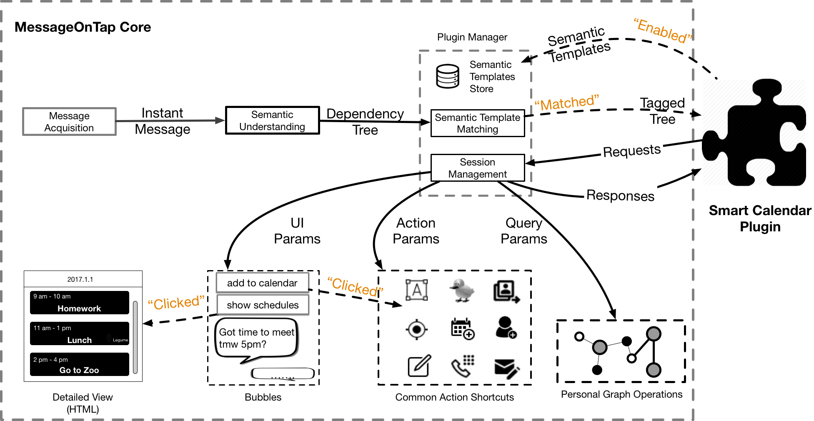
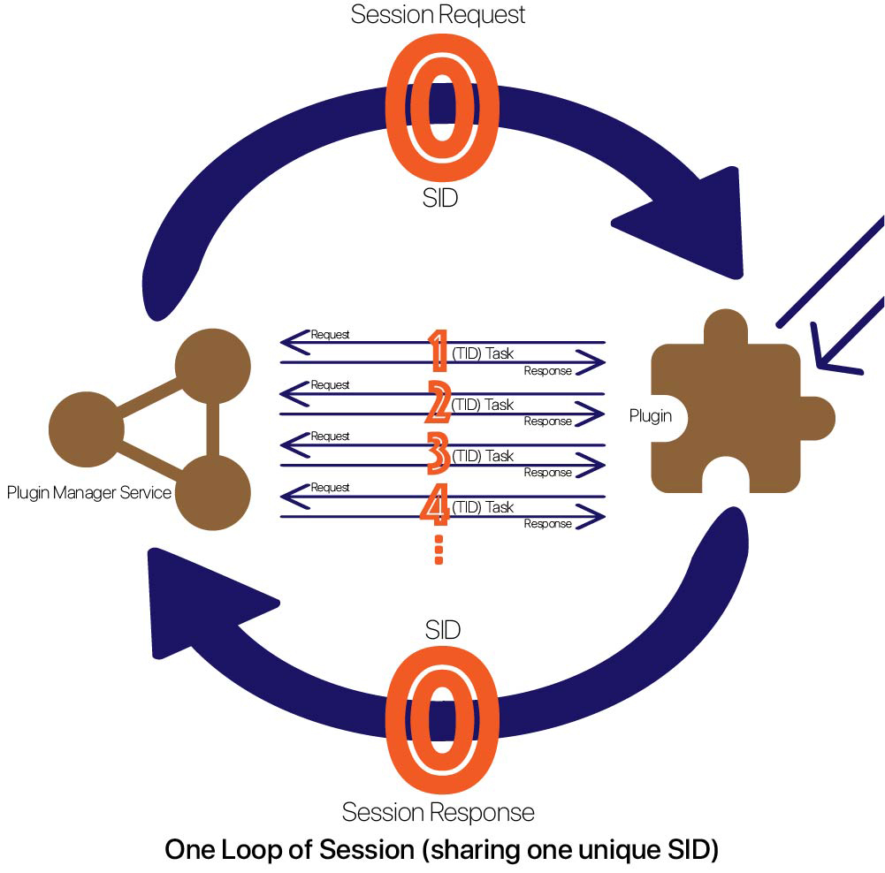

**The master branch is currently used for 1.x development. For 0.x stable releases, please check out the [0.x-dev branch](https://github.com/MessageOnTap/MessageOnTap_API/tree/0.x-dev).**

# MessageOnTap API 

MessageOnTap API ([CHANGE LOG](CHANGELOG.md), lastest version: <u>0.3.4</u>) is an IPC ([Interprocess Communication](https://en.wikipedia.org/wiki/Inter-process_communication)) library for MessageOnTap-powered plugins to communicate to MessageOnTap Core. MessageOnTap team has already develoepd several example IM plug-ins, which can be found [here](https://github.com/MessageOnTap/MessageOnTap_Plugins). 

## About MessageOnTap
[MessageOnTap](https://github.com/MessageOnTap) is a development framework for personal-data-powered messaging assistants. MessageOnTap is designed for developers to implement intelligent plugins for instant messaging apps to extend their basic functionalities. MessageOnTap streamlines instant messaging experiences by eliminating costly and repetitive tasks raised in conversation. These tasks could be adding events to the calendar or looking up the flight booking number for a friend. By surfacing useful prompts and actions, MessageOnTap squeezes tasks which normally takes minutes to complete into just a few taps. The key idea of MessageOnTap is to capture user needs through the message semantics and connect the observed needs to users' personal data.

Using the MessageOnTap framework, developers can create plugins for instant messaging apps such as Facebook Messenger, WhatsApp, WeChat, etc to extend basic messaging functionalities. Given easy access to both users instant messages and other types of personal data through MessageOnTap, MessageOnTap plugins can choose to either simply present a related piece of personal data for users to take a quick glimpse or offer users quick action shortcuts of functionalities if more user inputs are involved.

## Plugin-Core Communication Overview

In MessageOnTap development framework, while plugins are in charge of the logical flow (what to do after users receive certain messages), MessageOnTap-Core does the heavy lifting to offer message acquisition, message understanding, common action shortcuts, and personal graph operations.

When a plugin is enabled by the user, MessageOnTap-Core will ask the plugin to set up a few [semantic templates](https://github.com/MessageOnTap/MessageOnTap_API/wiki/Semantic-Templates) to specify what kind of messages this plugin deals with. When user receives a message, MessageOnTap-core will analyze it and store it as a ParseTree with tags matched, and will then match all the semantic templates set by plugins.

If one registered semantic template matches an instant message, MessageOnTap-Core will initiate a new session with a tagged tree. A tagged tree represents a dependency tree with all essential linguistic components of a message. The tagged tree can serve as the basis for plugin to perform a series of following tasks over the communication within the session:

* **[UI](https://github.com/MessageOnTap/MessageOnTap_API/wiki/MessageOnTap-UI)**, to display bubbles or HTML detailed views;
* **[Action](https://github.com/MessageOnTap/MessageOnTap_API/wiki/Action-Shortcuts)**, to perform all sorts of action shortcuts of existing features or services on phone, like redirecting users to the default Gmail app to compose email;
* **[Graph Operations](https://github.com/MessageOnTap/MessageOnTap_API/wiki/Personal-Graph)**, to query (retrieve or update) a piece of personal knowledge graph.

## Contributing
### License
This project is open-sourced under Apache 2.0.

### New Version Releasing
Change the VERSION file, README file, and CHANGELOG file. The Jenkins server will do the hard job for deploying onto our artifactory server (maven repo).
